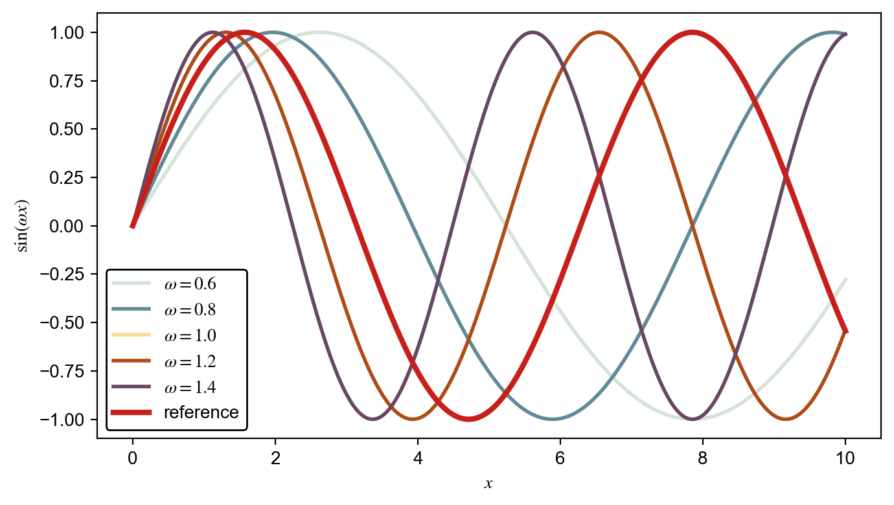
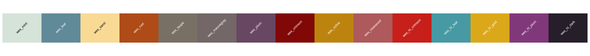

# synosys-styles

Matplotlib styling utilities and color palettes used in projects of the  
**Center Synergy of Systems (SynoSys)**.

The package provides:

- a curated **Wes Anderson–inspired color palette**
- **highlight colors** for emphasized curves
- **named colors usable directly in matplotlib**
- a simple function to configure **consistent matplotlib defaults**
- publication-friendly **font and mathtext settings**

---

## Installation

Install from PyPI:

```bash
pip install synosys-styles
```

---

## Quick start

Activate the SynoSys style at the beginning of your script:

```python
import synosys_styles as ss
import matplotlib.pyplot as plt

ss.use()

plt.plot([0, 1, 2], [1, 2, 3], color="wes_teal")
plt.plot([0, 1, 2], [2, 2.5, 2.2], color="wes_hl_crimson", linewidth=3)

plt.xlabel(r"$x$")
plt.ylabel(r"$f(x)$")

plt.show()
```

---

## Example figure



---

## What `use()` does

Calling

```python
ss.use()
```

applies SynoSys matplotlib defaults:

- registers named SynoSys colors
- sets a Wes-inspired default color cycle
- sets the default font family to **Arial**
- uses **STIX math fonts** for mathematical labels
- applies consistent legend styling

This ensures figures across projects have a consistent appearance.

---

## Palette preview



---

## Named colors

### Base palette

```
wes_mint
wes_teal
wes_sand
wes_rust
wes_taupe
wes_mauvegray
wes_plum
wes_crimson
wes_ochre
wes_rosewood
```

### Highlight palette

```
wes_hl_crimson
wes_hl_teal
wes_hl_gold
wes_hl_plum
wes_hl_dark
```

These colors can be used directly in matplotlib:

```python
plt.plot(x, y, color="wes_teal")
plt.plot(x, y_mean, color="wes_hl_crimson", linewidth=3)
```

---

## Typical plotting pattern

A common use case is plotting many trajectories with an emphasized mean:

```python
plt.plot(x, ensemble.T, color="wes_hl_dark", alpha=0.25)
plt.plot(x, mean, color="wes_hl_crimson", linewidth=3)
```

This produces a clear visual hierarchy between background curves and the main result.

---

## Font and math styling

`synosys_styles` uses:

```
font.family = "Arial"
mathtext.fontset = "stix"
text.usetex = False
```

This provides math-style labels similar to LaTeX while avoiding a full LaTeX dependency.

Example:

```python
plt.xlabel(r"$t$")
plt.ylabel(r"$P(t)$")
```

---

## Development installation

To work on the package locally:

```bash
git clone https://github.com/dirkbrockmann/synosys-styles.git
cd synosys-styles
uv pip install -e .
```

---

## License

MIT License

---

## About SynoSys

**SynoSys — Center Synergy of Systems**

This package collects plotting styles used across SynoSys research projects to ensure consistent figure design.
